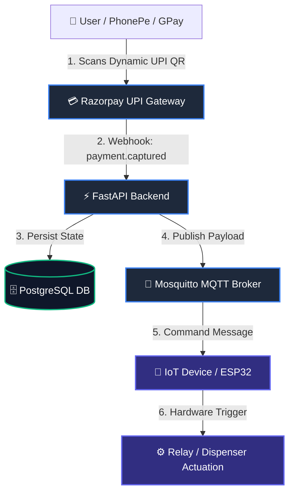

# Razorpay UPI to MQTT Payment Gateway (`razorpay-upi-mqtt-fastapi`)

A production-ready, microservices-based IoT payment gateway built with **FastAPI**, **Razorpay UPI Dynamic QR**, **PostgreSQL**, and **Eclipse Mosquitto MQTT**. Fully containerized with **Docker Compose**.

This service bridges real-time UPI micro-transactions with hardware actuation (vending machines, smart water dispensers, EV charging stations, and IoT relays).

---

## 📌 Architecture Overview

---

## ✨ Features

- **Dynamic UPI QR Generation:** Instant payment QR creation via Razorpay API for hardware terminals.
- **Secure Webhook Handler:** HMAC-SHA256 signature verification to handle `payment.captured` securely.
- **Asynchronous Processing:** Built using `asyncio`, `SQLModel`, and `asyncpg` for high throughput.
- **MQTT Broker Integration:** Real-time hardware event dispatch via Eclipse Mosquitto broker.
- **Database Migrations:** Schema evolution handled cleanly via `Alembic`.
- **Hardware Simulation:** Included Python hardware emulator for testing MQTT payloads without physical devices.
- **Dockerized Stack:** Single-command local environment spinning up Postgres, Mosquitto, and FastAPI.

---

## 🛠️ Tech Stack

- **Backend:** FastAPI, Python 3.11+, Pydantic v2
- **Database:** PostgreSQL, SQLModel / Async SQLAlchemy
- **Messaging:** Eclipse Mosquitto, `aiomqtt` / `paho-mqtt`
- **Payments:** Razorpay Python SDK (`razorpay`)
- **DevOps:** Docker, Docker Compose, Uvicorn
